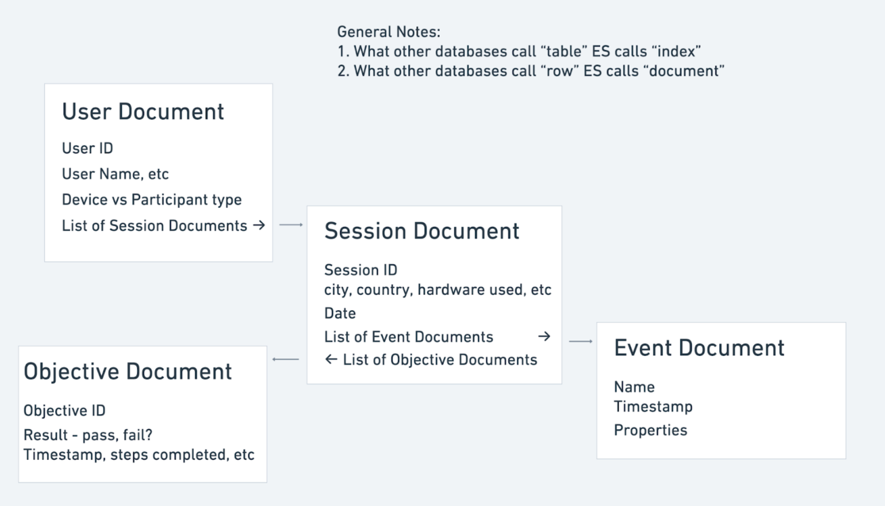

## The Big Picture
Slicer requests are a family of endpoints that all live on this service that together constitute almost all the session data retrieval for our FE apps and 3rd party integrators. These requests all produce requests to Elasticsearch, the primary database used for serving session data. This document will cover the main endpoint in this family, the "slicer request" endpoint. This endpoint is used to fetch aggregated user, session, event, or objective data.

All the other endpoints, some of which return more specialized aggregated data and some which return just raw non-aggregated session data, borrow components from this one both in terms of their inputs and outputs.

The general scope of what is possible to do with slicer queries is just a product of what is possible with Elasticsearch and our specific schema on it. We have one main index that is relevant for slicer queries, and a less important index that is used in 1 other route (the cube aggregation route) that will not be discussed here.

> This document covers just the structure of the "slicer request" endpoint, but doesn't fully catalogue the fields and properties available.
> 
> For the catalogue of common fields and properties, see [`slicer_fields.yaml`](slicer_fields.yaml).
>
> For a guide on how to use discovery routes to programmatically fetch fields and properties for a project, see [`slicer_api_guide.md`](slicer_api_guide.md). (Includes also instructions on UI tooling concerns like how to get all values for a given property, EG to populate a dropdown.)

## Section 0: Introduction, Elasticsearch Schema

In one index, two types of documents are shared across a parent/child join, allowing queries to filter or aggregate across this relationship.

Session documents are the core of the schema's philosophy and consist of:
1. some limited top level fields like start date, duration, etc
2. free-form properties in the form of key/value pairs in a trio of nested fields, one for boolean props, one for string props, and one for numeric props.
3. objective completion data in two nested fields. one for overall objective results and one for objective per-step results.
4. event data in a nested field. other than some top level stuff like date, name, dynamic object ID, events themselves have a further nested trio of property fields just like sessions do.
5. some other special fields that are not supported by the general purpose slicer route are also present and used to power specific widgets. 

User documents have a fairly limited set of metadata on them and refer to the user of a given session. More features are planned in the future to expand the capabilities in terms of filtering or aggregating on user data.



## Section 1: Aggregations
Each slicer request includes 1 or more aggregations that define what data should be produced. Each aggregation itself comprises 1 or more operations and 0-2 slice by's.

### Operations
Include a json object per operation you want in an array called `operations`. An operation has at minimum a [name](#Name) and a type. For example:
```json
{
  "name": "total_session_count",
  "type": "sessionCount"
}
```
Some types will require a [field reference](#Field-Reference). For example:
```json
{
  "name": "sum_calories_burned",
  "type": "sum",
  "field": {
    "nestedFieldName": "numericalEventProp",
    "fieldParent": "event",
    "path": "bc_current_session_calories"
  }
}
```
Table of the operation types and how to use them:

| Type                     | Requires Field Reference? | Other Fields Required? |
|--------------------------|---------------------------|------------------------|
| SessionCount, EventCount | No                        | nope                   |
| Min, Max, Average, Sum   | Yes                       | nope                   |
| Groups                   | Yes                       | `interval`             |
| CustomGroups             | Yes                       | `groups`               |

### Slice By's
An operation essentially produces a single number, but can be sliced into buckets by a slice by or even multiple. Include a json object per slice by you want in an array called `sliceBys`.

**IMPORTANT: `sliceBys` is a sibling to `operations` at the aggregation level, NOT nested inside an operation object.** If you put `sliceBys` inside an operation, it will be silently ignored and you'll get a single aggregated value instead of buckets.

```json
{
  "aggregations": [{
    "name": "main",
    "sliceBys": [ ... ],    // ✓ CORRECT - sibling to operations
    "operations": [ ... ]
  }]
}
```
A slice by has at minimum a [name](#Name). The type of slice by you want will dictate the other fields you have to include. The most common types are date histograms (show me the data over time, eg daily) and discrete field slices (show me the data split by the value of some field).

For a date histogram:
```json
{
  "name": "slice_by_week",
  "timeUnit": "week",
  "timeValue": 1,
  "dayOfWeekOffset": 1,
  "timeZone": "America/Vancouver",
  "field": {
    "fieldName": "date",
    "fieldParent": "session"
  }
}
```
Include:
- a [name](#Name)
- a time unit: day, week, month, quarter, year
- a value for groups of that unit: so 1 day buckets, 2 day buckets, etc
- an optional day of week offset that is only allowed if timeUnit=week; use this to change the default behavior of the week starting on sunday
- a timezone; the default is of course UTC
- a [field reference](#Field-Reference) for a date field; this is almost always going to be session date or event date

You will receive your data bucketed by the values of the time field with the options you requested

For a discrete field slice:
```json
{
  "name": "slice_by_app_version",
  "maxTerms": 64,
  "field": {
    "unnestedFieldName": "textualSessionProp",
    "path": "c3d.app.version"
  }
}
```
Include:
- a [name](#Name)
- optionally a max number of buckets to return, default is 256 and maximum is 1024
- a [field reference](#Field-Reference) for any field

You will receive your data bucketed by discrete values of the field. There are also a few ways to bucket by a field in groups (histograms, ranges, and custom discrete value groups), ask me to add them here if you want them.

### The Rest and Putting it All Together
In addition to the `operations` and `sliceBys` fields, include a [name](#Name) and optionally an output format.

<details>
  <summary>Full Aggregation Example</summary>

```json
{
  "name": "main",
  "outputType": "json0_key_y",
  "sliceBys": [
    {
      "name": "slice_by_app_version",
      "maxTerms": 64,
      "field": {
        "unnestedFieldName": "textualSessionProp",
        "path": "c3d.app.version"
      }
    },
    {
      "name": "slice_by_week",
      "timeUnit": "week",
      "timeValue": 1,
      "field": {
        "fieldName": "date",
        "fieldParent": "session"
      }
    }
  ],
  "operations": [
    {
      "name": "count_sessions",
      "type": "sessionCount"
    }
  ]
}
```

</details>

Here we are requesting daily session counts per app version. We will get values split by 2 dimensions in the output, but we could just as easily get a 1 dimensional output by removing one of the slice by's or a 0 dimensional output (IE just a single number!) by removing both. [More on the output format later.](#Output)


## Section 2: Filters
Typically, you will want to filter down the dataset when running almost any slicer request. For example, the dashboard has free form filters available on most pages and, additionally, will either be filtering out or filtering to just test/junk sessions. There are four top level fields in the slicer request that control what Elasticsearch documents are considered when serving any request.

### Session Filters
The optional top level field `sessionFilters` can have 1 or more filters in it. A filter can either ask that a field have some kind of value or be a conjunction of other filters. In the former case, you typically include a [field reference](#Field-Reference) to a session field, an operation, and a value:
```json
{
  "field": {
    "fieldName": "date",
    "fieldParent": "session"
  },
  "op": "lte",
  "value": 1677830399999
}
```
In this example we filter to sessions that occurred before a given date. The ops that follow this pattern are "gte", "lte", "gt", "lt", "neq", and "eq". You can ask that a field be present at all by using the "eq" op with value null, or that a field be absent by using the "neq" op with the value null.

There are also the two ops "in" and "notIn". For these, specify an array of values with key `values` instead of `value`.

There are also the two ops "range" and "outsideRange". For these, do not specify `value` and instead specify one or both of `min` and `max`.

For filters that join other filters with a logical operator, include just a logical operator type and a list of child filters:
```json
{
  "op": "and",
  "children": [
    {
      "op": "eq",
      "field": {
        "nestedFieldName": "booleanSessionProp",
        "path": "c3d.session_tag.test"
      },
      "value": false
    },
    {
      "op": "eq",
      "field": {
        "nestedFieldName": "booleanSessionProp",
        "path": "c3d.session_tag.junk"
      },
      "value": false
    }
  ]
}
```
In this example we filter to sessions that are not tagged with the test or junk tags.
This can produce very complex structures but the logic behind it is simple. Each child in the `children` array is just a filter, even another compound filter. The only other field, `op`, must be one of "or", "and", or "none".

### Entity Filters
Semantically, these function the same as the free form session filters. 
```json
...
"entityFilters": {
  "projectId": 240,
  "sceneId": "579f23a5-6f03-46b8-8898-6361d7d1cc7a",
  "versionId": 309
}
...
```
All that's going on here is these 3 specific session fields are enshrined and kept separate for convenience and to make it easier to perform auth checks in edge. I list all 3 for completeness but the latter 2 (`sceneId`, `versionId`) are not supported when you are [requesting data from project sessions](#Session-Type). So typically you should just have this:
```json
...
"entityFilters": {
  "projectId": 240
}
...
```
This field with at minimum `projectId` set is mandatory. `projectId` must be a JSON **number** — a quoted string (`"projectId": "240"`) is rejected with a 400.

### Event Filters
The optional top level field `eventFilters` can have 1 or more filters in it. These function similarly to session filters, but the fields referenced must be event fields. What actually happens when you filter on session vs event fields, while aggregating session vs event fields, can be tricky, however. Bearing in mind that a session has many events:


|                         | Aggregating Session field                                                                                                                                                                   | Aggregating Event Field                                                                            |
|-------------------------|---------------------------------------------------------------------------------------------------------------------------------------------------------------------------------------------|----------------------------------------------------------------------------------------------------|
| Filtering Session Field | Intuitive. If the session does not match the filter, it is discarded.                                                                                                                       | Intuitive. If an event's parent session does not match the session filter, the event is discarded. |
| Filtering Event Field   | Tricky! What we do in this case is require that the session must have _at least 1_ event that matches the given filter. This supports many common use cases but may not be what you expect! | Intuitive. If the event does not match the filter, it is discarded.                                |

### User Filters
The optional top level field `userFilters` can have 1 or more filters in it and is used to implement user segmentation. Unlike session/event filters, no fancy joining logic is supported at this time, though everything in the list is of course implicitly joined with an "and" operator. Most filters will take this form, with a simple string `field` rather than the usual field reference structure, an `op`, and a `value`:
```json
{
  "field": "latestSession",
  "op": "lt",
  "value": 1727448547826
}
```

Available fields:

| Field               | Description                                          |
|---------------------|------------------------------------------------------|
| `latestSession`     | Timestamp of the user's most recent session          |
| `earliestSession`   | Timestamp of the user's first session                |
| `2ndLatestSession`  | Timestamp of the user's second most recent session   |
| `sessionDatesArray` | Array of all session timestamps for the user. Supports `outsideRange` op to assert that no sessions fall within a given time range. |

#### User Segmentation Examples
These examples show how to implement the standard user segments. All timestamp values should be epoch milliseconds.

**Churned users** (no sessions for 28 days):
```json
{
  "userFilters": [
    {
      "field": "latestSession",
      "op": "lt",
      "value": 1727448547826
    }
  ]
}
```

**Retained users** (at least 1 session in last 28 days, first session more than 28 days ago):
```json
{
  "userFilters": [
    {
      "field": "latestSession",
      "op": "gte",
      "value": 1727448547826
    },
    {
      "field": "earliestSession",
      "op": "lt",
      "value": 1727448547826
    }
  ]
}
```

**New users** (first session within the last 28 days):
```json
{
  "userFilters": [
    {
      "field": "earliestSession",
      "op": "gte",
      "value": 1727448547826
    }
  ]
}
```

**Resurrected users** (at least one session before 56 days ago, none in the 56→28 day window, then at least one in the last 28 days):
```json
{
  "userFilters": [
    {
      "field": "earliestSession",
      "op": "lt",
      "value": 1725029347826
    },
    {
      "field": "latestSession",
      "op": "gte",
      "value": 1727448547826
    },
    {
      "field": "sessionDatesArray",
      "op": "outsideRange",
      "min": 1725029347826,
      "max": 1727448547826
    }
  ]
}
```
The `sessionDatesArray` filter asserts that every session timestamp must fall outside the given range — effectively requiring no sessions in the 56→28 day window.

### Objective Filters
The optional top level field `objectiveFilters` is used to filter on objective results. It is an array where each item represents a filter, chained together with an implicit "AND". Compound logic such as OR is not supported at this time. Each filter requires an `objectiveVersionId` and a `type`.

Filter types:

| Type                       | Description                                                                                                                                                          | Additional Fields          |
|----------------------------|----------------------------------------------------------------------------------------------------------------------------------------------------------------------|----------------------------|
| `passed`                   | The objective was passed.                                                                                                                                            | none                       |
| `failed`                   | The objective was not passed.                                                                                                                                        | none                       |
| `numStepsCompleted`        | Evaluates `op` and `value` against the number of steps that were completed. Doesn't care which particular steps, just the count.                                     | `op` and `value`           |
| `percentageStepsCompleted` | Evaluates `op` and `value` against the percentage of steps, out of the total number of steps on this objective, that were passed. (e.g. 2/4 steps completed = 50.0)  | `op` and `value`           |
| `stepPassed`               | The objective step was passed. For sequential objectives, a step cannot be passed unless its predecessors were passed.                                                | `step` (index of the step) |
| `stepFailed`               | The objective step was not passed. For sequential objectives, a step will always be failed if any predecessor was failed.                                             | `step` (index of the step) |
| `stepTime`                 | Filters on the session-relative time that the step was either completed or failed.                                                                                   | `step`, `op`, and `value`  |
| `stepTimeToSessionEnd`     | Filters on the time between the step completion/failure and the end of the session.                                                                                  | `step`, `op`, and `value`  |
| `stepDuration`             | Filters on the time it took for the step to either complete or fail, relative to the previous step in the objective.                                                 | `step`, `op`, and `value`  |
| `stepTimeProportion`       | Similar to `stepTime` but the proportion of the session (0–1) at which the step was completed/failed, rather than absolute time.                                     | `step`, `op`, and `value`  |

Examples of passed and failed:
```json
{
  "objectiveFilters": [
    {
      "objectiveVersionId": 123,
      "type": "passed"
    },
    {
      "objectiveVersionId": 124,
      "type": "failed"
    }
  ]
}
```
Filters to sessions that passed objective version 123 but failed at 124.

Example of step passed and failed:
```json
{
  "objectiveFilters": [
    {
      "objectiveVersionId": 123,
      "type": "stepPassed",
      "step": 1
    },
    {
      "objectiveVersionId": 123,
      "type": "stepFailed",
      "step": 2
    }
  ]
}
```
Filters to sessions that, for objective version 123, succeeded at the first step but failed at the second step.

Example of step time combined with step passed:
```json
{
  "objectiveFilters": [
    {
      "objectiveVersionId": 123,
      "type": "stepPassed",
      "step": 1
    },
    {
      "objectiveVersionId": 123,
      "type": "stepTime",
      "step": 1,
      "op": "lte",
      "value": 60000
    }
  ]
}
```
Filters to sessions that completed the first step successfully within the first minute of the session. Note that both passed and failed steps have a timestamp, so `stepTime` alone filters on the timestamp regardless of pass/fail. In practice, a step time filter should typically have a sibling `stepPassed` or `stepFailed` filter.

## Section 3: The Light at the End of the Tunnel
I'll cover a few miscellaneous fields that didn't fit in the other sections, show an example of a full request, and then cover the output format.

### Session Type
This field is used to control whether you query real sessions or scene sessions. Sadly the default is scene sessions because some little bits and corners of the FE are still on those (mostly the analysis page) and we don't want to make some poor soul go and crawl through every single slicer request and add this field. But you, dear reader, please always include this line:
```json
...
"sessionType": "project",
...
```
So that your request hits project sessions, AKA, the real sessions.

### Putting it All Together
Building from the prior examples, let us combine them all into a fully fledged slicer request:

<details>
  <summary>Full Request JSON</summary>

```json
{
  "sessionType": "project",
  "entityFilters": {
    "projectId": 541
  },
  "sessionFilters": [
    {
      "field": {
        "fieldName": "date",
        "fieldParent": "session"
      },
      "op": "lte",
      "value": 1742977802000
    },
    {
      "op": "and",
      "children": [
        {
          "op": "eq",
          "field": {
            "nestedFieldName": "booleanSessionProp",
            "path": "c3d.session_tag.test"
          },
          "value": false
        },
        {
          "op": "eq",
          "field": {
            "nestedFieldName": "booleanSessionProp",
            "path": "c3d.session_tag.junk"
          },
          "value": false
        }
      ]
    }
  ],
  "aggregations": [
    {
      "name": "main",
      "outputType": "json0_key_y",
      "sliceBys": [
        {
          "name": "slice_by_app_version",
          "maxTerms": 64,
          "field": {
            "unnestedFieldName": "textualSessionProp",
            "path": "c3d.app.version"
          }
        },
        {
          "name": "slice_by_week",
          "timeUnit": "week",
          "timeValue": 1,
          "field": {
            "fieldName": "date",
            "fieldParent": "session"
          }
        }
      ],
      "operations": [
        {
          "name": "count_sessions",
          "type": "sessionCount"
        }
      ]
    }
  ]
}
```

</details>

This request asks for weekly session counts split by app version, excluding junk and test sessions, before a given point in time. It could be used for example to populate a line chart with a line per app version, where the x axis is week and the y axis is session count.

### Output
You get a top level field `aggregations` with a key per aggregation requested (keyed by its name), the value is an object with again a key per _operation_ requested within that aggregation (keyed by its name again), and the value of that is an object with fields `values` and `warnings`. So here because we named our 1 aggregation "main" and its 1 operation "count_sessions" we get a structure like this:
```json
{
  "aggregations": {
    "main": {
      "count_sessions": {
        "values": { ... },
        "warnings": []
      }
    }
  }
}
```
The contents of `values` depends on the format you requested, and I'll separate it here for readability:

<details>
  <summary>Values Array</summary>
  
  ```json
  [
    {
      "x": 1733702400000,
      "values": {
        "0.1": 0,
        "0.2": 0,
        "0.3": 0,
        "0.4": 0,
        "0.5": 0,
        "0.6": 0,
        "0.7": 0,
        "0.8": 0,
        "1.0": 27
      }
    },
    {
      "x": 1734307200000,
      "values": {
        "0.1": 13,
        "0.2": 1,
        "0.3": 0,
        "0.4": 0,
        "0.5": 0,
        "0.6": 0,
        "0.7": 0,
        "0.8": 0,
        "1.0": 17
      }
    },
    {
      "x": 1734912000000,
      "values": {
        "0.1": 0,
        "0.2": 0,
        "0.3": 0,
        "0.4": 0,
        "0.5": 0,
        "0.6": 0,
        "0.7": 0,
        "0.8": 0,
        "1.0": 0
      }
    },
    {
      "x": 1735516800000,
      "values": {
        "0.1": 0,
        "0.2": 13,
        "0.3": 0,
        "0.4": 0,
        "0.5": 0,
        "0.6": 0,
        "0.7": 0,
        "0.8": 0,
        "1.0": 0
      }
    },
    {
      "x": 1736121600000,
      "values": {
        "0.1": 0,
        "0.2": 3,
        "0.3": 0,
        "0.4": 0,
        "0.5": 0,
        "0.6": 0,
        "0.7": 0,
        "0.8": 0,
        "1.0": 1
      }
    },
    {
      "x": 1736726400000,
      "values": {
        "0.1": 0,
        "0.2": 0,
        "0.3": 0,
        "0.4": 0,
        "0.5": 0,
        "0.6": 0,
        "0.7": 0,
        "0.8": 0,
        "1.0": 2
      }
    },
    {
      "x": 1737331200000,
      "values": {
        "0.1": 0,
        "0.2": 0,
        "0.3": 4,
        "0.4": 0,
        "0.5": 0,
        "0.6": 0,
        "0.7": 0,
        "0.8": 0,
        "1.0": 0
      }
    },
    {
      "x": 1737936000000,
      "values": {
        "0.1": 0,
        "0.2": 0,
        "0.3": 0,
        "0.4": 15,
        "0.5": 0,
        "0.6": 0,
        "0.7": 0,
        "0.8": 0,
        "1.0": 0
      }
    },
    {
      "x": 1738540800000,
      "values": {
        "0.1": 0,
        "0.2": 0,
        "0.3": 0,
        "0.4": 0,
        "0.5": 1,
        "0.6": 0,
        "0.7": 0,
        "0.8": 0,
        "1.0": 0
      }
    },
    {
      "x": 1739145600000,
      "values": {
        "0.1": 0,
        "0.2": 0,
        "0.3": 0,
        "0.4": 0,
        "0.5": 12,
        "0.6": 8,
        "0.7": 0,
        "0.8": 0,
        "1.0": 27
      }
    },
    {
      "x": 1739750400000,
      "values": {
        "0.1": 0,
        "0.2": 0,
        "0.3": 0,
        "0.4": 0,
        "0.5": 0,
        "0.6": 186,
        "0.7": 3,
        "0.8": 0,
        "1.0": 0
      }
    },
    {
      "x": 1740355200000,
      "values": {
        "0.1": 0,
        "0.2": 0,
        "0.3": 0,
        "0.4": 0,
        "0.5": 0,
        "0.6": 6,
        "0.7": 1,
        "0.8": 0,
        "1.0": 2
      }
    },
    {
      "x": 1740960000000,
      "values": {
        "0.1": 0,
        "0.2": 0,
        "0.3": 0,
        "0.4": 0,
        "0.5": 0,
        "0.6": 1,
        "0.7": 45,
        "0.8": 12,
        "1.0": 0
      }
    },
    {
      "x": 1741564800000,
      "values": {
        "0.1": 0,
        "0.2": 0,
        "0.3": 0,
        "0.4": 0,
        "0.5": 0,
        "0.6": 0,
        "0.7": 0,
        "0.8": 0,
        "1.0": 0
      }
    },
    {
      "x": 1742169600000,
      "values": {
        "0.1": 0,
        "0.2": 0,
        "0.3": 0,
        "0.4": 0,
        "0.5": 0,
        "0.6": 0,
        "0.7": 0,
        "0.8": 12,
        "1.0": 0
      }
    },
    {
      "x": 1742774400000,
      "values": {
        "0.1": 0,
        "0.2": 0,
        "0.3": 0,
        "0.4": 0,
        "0.5": 0,
        "0.6": 0,
        "0.7": 0,
        "0.8": 2,
        "1.0": 0
      }
    }
  ]
  ```

</details>

We can see a fun little story unfolding here. The initial build of this project had the default app version "1.0", at some point the developer switched to a more apt "0.1", and incremented it by .1 every few weeks henceforth. We see that as we might expect, only data is only coming from one or two app versions on any given week. Mostly. Sometimes "1.0" came back in later weeks.

> Despite the age and complexity of the slicer project, the output formats are still very provisional. The default one is still the only one used by the dashboard. We are happy to add more of them so suggest away if you have ideas.

### All Output Types Reference

In depth descriptions and examples are available [here](output_types.md) for the current 4 output formats available, and what they output for 0, 1, or 2 dimensional aggregations. The names of the types are `legacy`, `json0_keyed`, `json0_list`, and `json0_key_y`.


## Glossary: Common Concepts

### Value Types

| Type        | Numerical Operations (sum, avg, etc.) | Relational Operations (gt, lt, etc.) |
|-------------|---------------------------------------|--------------------------------------|
| `numerical` | Yes                                   | Yes                                  |
| `integral`  | Yes                                   | Yes                                  |
| `timestamp` | Yes                                   | Yes                                  |
| `textual`   | No                                    | No                                   |
| `boolean`   | No                                    | No                                   |

### Operation Types

| Name           | Display Name        | Requires Field? | Notes                                  |
|----------------|---------------------|-----------------|----------------------------------------|
| `sessionCount` | Total Session Count | No              | Counts sessions                        |
| `eventCount`   | Total Event Count   | No              | Counts events                          |
| `min`          | Minimum Value       | Yes             | Requires a numerical/integral field    |
| `max`          | Maximum Value       | Yes             | Requires a numerical/integral field    |
| `average`      | Average Value       | Yes             | Requires a numerical/integral field    |
| `sum`          | Sum of Values       | Yes             | Requires a numerical/integral field    |

These are also available programmatically via `GET /v0/datasets/sessions/slicerOptions` (no request body).

### Built-in Session Fields
These are some of the top-level fields on session documents, referenced with `"fieldParent": "session"` and `"fieldName"`:

| Field Name                      | Value Type  | Nullable | Notes                               |
|---------------------------------|-------------|----------|---------------------------------------|
| `date`                          | timestamp   | No       | Session start time (epoch ms)         |
| `duration`                      | integral    | No       | Session duration (ms)                 |
| `participantId`                 | textual     | Yes      | User/participant identifier           |
| `sessionId`                     | textual     | No       | Unique session identifier             |
| `organizationId`                | integral    | No       |                                       |
| `projectId`                     | integral    | No       |                                       |
| `userSessionNumber`             | integral    | No       | Nth session for this user             |

### Built-in Event Fields
These are some of the top-level fields on event documents, referenced with `"fieldParent": "event"` and `"fieldName"`:

| Field Name                      | Value Type  | Nullable | Notes                                            |
|---------------------------------|-------------|----------|--------------------------------------------------|
| `eventName`                     | textual     | No       | Name of the event                                |
| `date`                          | timestamp   | No       | Event timestamp (epoch ms)                       |
| `objectId`                      | textual     | Yes      | Dynamic object ID, if associated                 |
| `sessionRelativeDateTotal`      | timestamp   | No       | Time since session start (ms)                    |
| `sessionRelativeDateGapless`    | timestamp   | No       | Time since session start, excluding gaps (ms)    |
| `xCoord`                        | numerical   | No       | Position X                                       |
| `yCoord`                        | numerical   | No       | Position Y                                       |
| `zCoord`                        | numerical   | No       | Position Z                                       |

Both sessions and events also have property fields (textual, numerical, boolean) which are nested and require a `path` — see [Field Reference](#Field-Reference). Full field metadata including descriptions, units, and display names is available in [`slicer_fields.yaml`](slicer_fields.yaml).

### Name
The name of any slicer request's component is used just to key parts of the response. Because many components can come in lists, this makes it easier to read the response JSONs (rather than having to use indices or such). The main useful takeaway here is if you ever see a name in a slicer request, it does not actually do anything. It's just a label. As long as your names don't collide you won't change the semantics of the request.
```json
  ...
  "name": "countSessionsByCountry",
  ...
```
Not much more to it than that.

### Field Reference
A field reference is a way of referring to a particular facet of sessions or of events. At some point, this will include facets of users and objectives also. A field reference includes at minimum a field name and a field parent. It can also include additional data required to refer to a part of a complex field, such as the property fields. In that example you must include the property name. This example refers to the "date" field of sessions:
```json
  ...
  "field": {
    "fieldParent": "session",
    "fieldName": "date"
  },
  ...
```
Events also have a "date" field, and you'd set the field parent to "event" to refer to that one. To reference property fields:
```json
  ...
  "field": {
    "fieldParent": "session",
    "nestedFieldName": "booleanSessionProp",
    "path": "c3d.session_tag.junk"
  },
  ...
  ```
We include "path" which is the property name, and use `nestedFieldName` instead of `fieldName`. This structure is used for some other niche stuff but for properties, but the six property field names are:

| Field Name           | Type    | Field Parent |
|----------------------|---------|--------------|
| textualSessionProp   | string  | "session"    |
| numericalSessionProp | number  | "session"    |
| booleanSessionProp   | boolean | "session"    |
| textualEventProp     | string  | "event"      |
| numericalEventProp   | number  | "event"      |
| booleanEventProp     | boolean | "event"      |

**`nestedFieldName` vs `unnestedFieldName`:** Some commonly queried properties are also indexed as top-level fields in Elasticsearch for faster queries. For these properties, you can use `unnestedFieldName` instead of `nestedFieldName`. Properties that support this are marked with `unnested: true` in [`slicer_fields.yaml`](slicer_fields.yaml). Always default to `nestedFieldName` — it works for all properties. Only use `unnestedFieldName` if you have confirmed the property is unnested.

